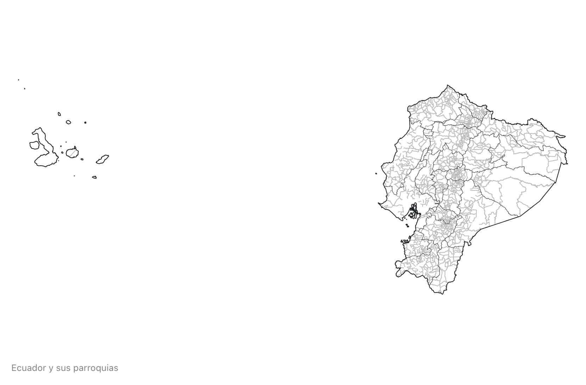
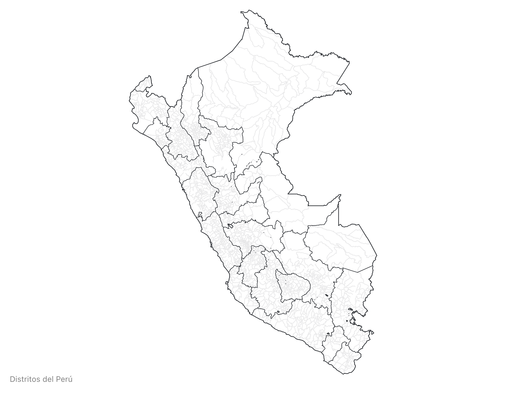

# Latin America Atlas TopoJSON

This repository provides [topoJSON files](https://github.com/topojson/topojson-specification/blob/master/README.md#21-topology-objects) you can use as a cartography on a webpage or using Plot in observablehq, see an example [here](https://observablehq.com/d/74241e5a73f974d7)

To align the names of subnational jurisdictions in different countries, four levels have been set:

* `level1`: country
* `level2`: provinces / departments
* `level3`: cantons / provinces
* `level4`: parishes / districts

## Generating the files

Clone or download the repo and start a terminal. Then run `npm run prepublishOnly` to transform the downloaded zip files into topojson files.

If you need to make further adjustments (projection, simplification, quantization) you can change the `prepublish` config file and run `npm run prepublishOnly` again.

### Concepts

<a href="#simplification" name="simplification">#</a> <i>simplification</i>

Removes points to reduce the file size. Set to 3% by default.

<a href="#quantization" name="quantization">#</a> <i>quantization</i>

Removes information by reducing the precision of each coordinate. Set to `1e5` by default.

### File Reference

The TopoJSON files contain 4 levels of geometry based on and **id code**, which in Ecuador is DPA_PARROQ and in Perú is UBIGEO .
The geometry is quantized and simplified. 

Each level4 has two properties:

* *level4.id* - the six-digit code, such as `"010152"`
* *level4.properties.name* - the district name, such as `"CUMBE"`

For the level 2 the first two digits of the **id code** is the province code.
For the level 3 the first four digits of the **id code** is the canton code.

## TopoJSON files
### Ecuador

* Source: [Ecuador cartographic boundary shapefiles](https://www.ecuadorencifras.gob.ec/documentos/web-inec/Geografia_Estadistica/Micrositio_geoportal/index.html)
* Projection: [https://epsg.io/32717](https://epsg.io/32717). 
* [Download](https://cdn.jsdelivr.net/npm/latam-atlas@0.1.0/files/ecuador-tm-50k.json "Source")

To visualize with d3.js:

```
d3
    .geoIdentity()
    .reflectY(true)
    .fitSize([width, height], features)
```

Parishes



### Perú

* Source: [Perú cartographic boundary shapefiles](https://www.idep.gob.pe/)
* Projection: [https://epsg.io/4326](https://epsg.io/4326). 
* [Download](https://cdn.jsdelivr.net/npm/latam-atlas@0.1.0/files/peru-100k.json "Source")

To visualize with d3.js:

```
d3
    .geoIdentity()
    .reflectY(true)
    .fitSize([width, height], features)
```

Districts




### Inspiration

The original idea and implementation comes from Mike Bostock’s [us-atlas](https://github.com/topojson/us-atlas) and [trase-atlas](https://github.com/bayre/trase-atlas).